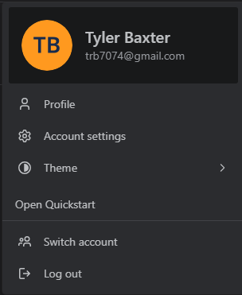
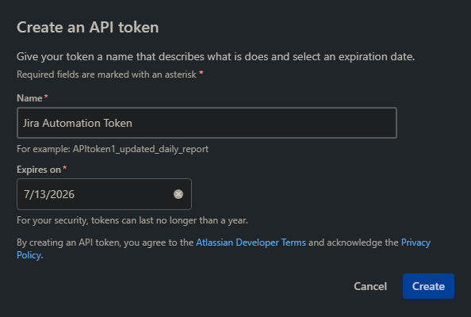
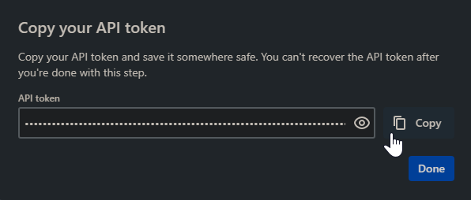

# jira-automation
Modular Python tool for automating sprint lifecycle tasks in JIRA.

 

Necessary libraries:
- Requests
- Responses

 

1.) Need an API token from JIRA. 

Can be obtained by visiting the Account Settings section from the Jira board page: 

Then select the Security tab at the top of the account settings: 

Then select the Create and manage API tokens hyperlink in the Security section: 

Click the Create API token button: 

Enter whatever name and set the expiration date for a year from the current date. 

Click the copy button and save the API token in a safe place.

 
 

  
File Details

  <ul>
      

        
Credentials.py

          <ul>
            <blockquote>
              

                This module is responsible for retrieving Jira API credentials
                (email and API token) from environment variables stored as 
                repository secrets using a pluggable accessor 
                (<code>getenv</code>) which defaults to <code>os.getenv</code>.
              

              

                It constructs a <code>Credentials</code> object, defined as a
                Pydantic model with strict validation via the custom 
                <code>SAFE_STR</code> type — stripping whitespace and 
                disallowing empty or <code>None</code> values.
              

              

                To avoid exposing internal validation details (such as
                <code>pydantic.ValidationError)</code>, these errors are 
                wrapped in a generic <code>ValueError</code> with a domain-
                specific message. This preserves encapsulation, makes failures
                diagnosable without leaking intenrals, and supports better
                abstraction for future refactors if necessary.
              

            </blockquote>
          </ul>
      

  </ul>

 
 