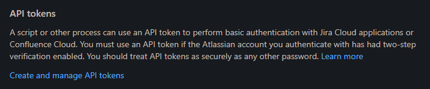

# jira-automation
Modular Python tool for automating sprint lifecycle tasks in JIRA.

 

Necessary libraries:
- Requests
- Responses

 

1.) Need an API token from JIRA. 

Can be obtained by visiting the Account Settings section from the Jira board page: 

Then select the Security tab at the top of the account settings: 

Then select the Create and manage API tokens hyperlink in the Security section: 

Click the Create API token button: 

Enter whatever name and set the expiration date for a year from the current date. 

Click the copy button and save the API token in a safe place.

